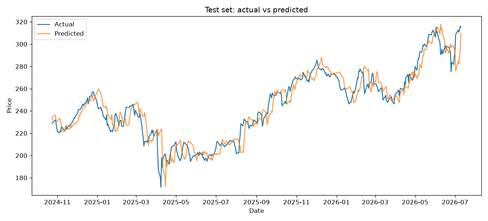
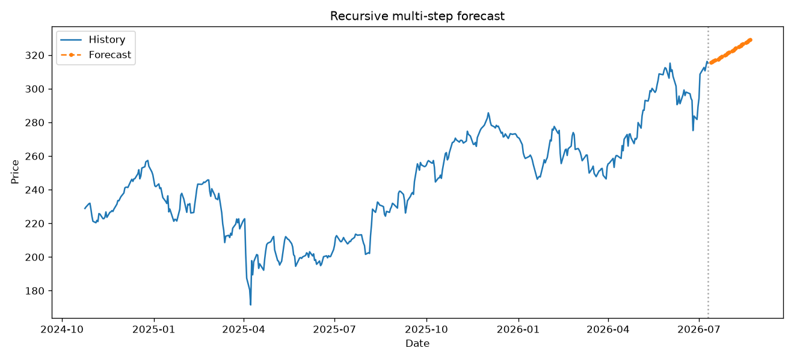

# 📈 Stock Price Prediction with an LSTM (PyTorch)


An end-to-end deep-learning pipeline that forecasts stock prices and predicts
price **direction** using a stacked LSTM — built on live Yahoo Finance data, with
**honest** evaluation against a naive baseline and walk-forward validation.

> This project is as much about *rigorous, leakage-safe methodology and honest
> evaluation* as it is about the model. It shows why naive absolute-price
> prediction is misleading, and reports the true (small) predictability of daily
> returns instead of hiding it behind a flattering R².

## 🚀 Quickstart

```bash
git clone https://github.com/<your-username>/stock-lstm.git
cd stock-lstm
python -m venv .venv
source .venv/bin/activate            # Windows: .\.venv\Scripts\Activate.ps1
pip install -r requirements.txt

python main.py                       # regression pipeline (AAPL)
python classify.py                   # class-balanced up/down classifier
```

If pip cannot find a `torch` wheel for your Python, grab the install command from
https://pytorch.org/get-started/locally/ (a CPU build is fine), then re-run
`pip install -r requirements.txt`.

## ✨ Features

- **Live data** via `yfinance` (any ticker), with a synthetic fallback so it runs
  even offline.
- **Stationary feature engineering**: multi-horizon log returns, price-to-moving-
  average ratios, RSI, Bollinger %B, price-relative MACD & ATR, volume ratio and
  rolling volatility (pure pandas, no TA-Lib).
- **Stacked LSTM** (optionally bidirectional) with dropout, Huber loss, Adam,
  early stopping, LR-on-plateau, weight decay and gradient clipping.
- **Leakage-safe preprocessing**: scalers fit on training rows only; windows split
  by target index so dates align 1:1 with predictions.
- **Two tasks**: return regression (`main.py`) and class-balanced direction
  classification (`classify.py`).
- **Honest metrics** in price, return and direction space, plus expanding-window
  walk-forward validation.
- Runs automatically on **CUDA / Apple MPS / CPU**.

## 🧭 Usage

```bash
python main.py --ticker MSFT --epochs 50   # override ticker / epochs
python main.py --horizon 1                 # 1-day forward return (config default 5)
python main.py --target-mode price         # legacy absolute-price target
python main.py --no-walk-forward           # faster
python main.py --smoke                     # tiny synthetic wiring test

python classify.py --ticker MSFT --horizon 5
python classify.py --smoke
```

## 📊 Results

Running produces these artifacts in `artifacts/`:

| Artifact | What it shows |
|----------|---------------|
| `test_predictions.png` | Actual vs. predicted price on the hold-out set |
| `future_forecast.png`  | Recursive multi-step forecast |
| `training_history.png` | Train vs. validation loss |
| `report.json` / `classify_report.json` | All metrics + baselines + walk-forward |

Embed them in this README once generated, e.g.:

```markdown



```

**Key finding.** Across four framings — price regression, return regression
(1-day and 5-day), and class-balanced direction classification — the model shows
no reliable predictive signal on AAPL daily data: return-space `IC ≈ 0`,
classifier `ROC-AUC ≈ 0.5`, and results flip sign across folds (noise, not
signal). This is the expected outcome for daily equity prices, which behave close
to a random walk. The project's value is the disciplined, honest pipeline that
surfaces this rather than masking it.

## 🗂 Project structure

```
stock-lstm/
├── README.md
├── LICENSE
├── requirements.txt
├── config.yaml
├── .gitignore
├── main.py                 # regression pipeline
├── classify.py             # direction classifier
└── src/
    ├── config.py           # config loading + seeding
    ├── data.py             # yfinance download + synthetic fallback
    ├── features.py         # stationary / legacy feature engineering
    ├── dataset.py          # target build, scaling, split, windowing
    ├── model.py            # stacked LSTM + inference helper
    ├── train.py            # regression training loop
    ├── evaluate.py         # price / return / direction metrics + walk-forward
    ├── predict.py          # recursive multi-step forecast
    ├── classify_data.py    # balanced up/down label windows
    ├── classify_train.py   # classifier training (BCE + pos_weight)
    └── plots.py            # matplotlib charts
```

## ⚙️ Configuration (`config.yaml`)

- `data.ticker`, `data.start`, `data.target_mode` (`log_return` or `price`).
- `data.exclude_features` — kept for the target but withheld from model input.
- `features.stationary` — `true` for scale-free features, `false` for legacy.
- `window.lookback`, `window.horizon` — sequence length and forward horizon.
- `model.*` — layer sizes, dropout, learning rate, weight decay, gradient clip.
- `walk_forward.n_splits` — number of expanding-window folds.

## 📐 How to read the metrics

- **Price space**: R² sits ~0.98 for almost any model because predicted price is
  anchored to yesterday's actual price. Not a measure of skill.
- **Return space (the honest test)**: R² vs. a "predict the mean return" baseline,
  and IC (correlation of predicted vs. actual returns). No-skill → `ret_R2 ≤ 0`,
  `IC ≈ 0`.
- **Direction**: accuracy, balanced accuracy, ROC-AUC, precision/recall/F1. Real
  skill = `ROC-AUC > 0.5` and `balanced_acc > 0.5` with both recalls > 0, holding
  across folds.

## 🛠 Tech stack

Python · PyTorch · NumPy · pandas · scikit-learn · yfinance · matplotlib

## ⚠️ Disclaimer

Educational / portfolio project only. Do not use these forecasts to trade real
money. Nothing here is financial advice.

## 📄 License

Released under the [MIT License](LICENSE).
